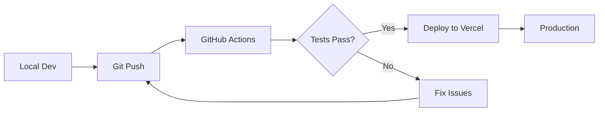

# 🚀 Cursor AI IDE: Building Production Applications

[](https://www.oreilly.com/)
[](https://cursor.com/)
[](https://nextjs.org/)
[](https://react.dev/)

> **Master AI-assisted development** — Learn to build full-stack production applications using Cursor's advanced features, project rules, agents, and MCP integration.

---

## 📋 Course Overview

This hands-on course takes developers beyond basic AI code completion to building complete, production-ready applications. You'll learn advanced Cursor workflows, context management strategies, and deployment best practices through practical, real-world projects.

### What You'll Learn

- **Advanced Cursor Features**: Context management, project rules, agents, and Model Context Protocol (MCP)
- **Full Application Development**: Build complete apps from scratch using AI assistance
- **React & Next.js Mastery**: Advanced patterns, state management, and architecture
- **Full-Stack Development**: Backend APIs, databases, authentication, and real-time features
- **Production Deployment**: Testing strategies, CI/CD, monitoring, and optimization
- **Best Practices**: Real-world workflows used by staff engineers and consultants

### What You'll Build

| Project | Description | Tech Stack |
|---------|-------------|------------|
| **Task Manager** | Full CRUD app with auth & real-time features | Next.js, Clerk, Supabase, Tailwind |
| **AI Quiz App** | Intelligent quiz generation from study materials | Next.js, Claude API, Supabase, Clerk |
| **ChronoFocus** | Time-blocking task scheduler | Next.js, Prisma, PostgreSQL |

---

## 🎯 Course Sections

The course is divided into 5 comprehensive sections:

### Section 1: Cursor & Context Management (60 minutes)
- Cursor overview and context management
- Codebase indexing and `@` symbol mastery
- Context windows and token management
- Understanding and creating project rules (`.cursor/rules/*.mdc`)
- Project rules and agents
- Agent types and background agents
- Model Context Protocol (MCP) introduction
- Live configuration demos

### Section 2: Building Your First Full App (60 minutes)
- AI-driven project initialization
- Creating architecture-specific project rules
- Building data layers with storage modules
- Core feature development (data layer, UI components)
- Creating UI components with AI assistance
- Adding real-time features
- Real-time features and polish
- Performance optimization strategies

### Section 3: Advanced App Development & Architecture (60 minutes)
- React project architecture and scaffolding
- React project scaffolding with Cursor
- Advanced project rules for React
- Advanced project rules for React patterns
- State management patterns (Zustand)
- Building an AI-powered quiz app
- Building an AI-powered Quiz App
- Advanced UI/UX features and testing
- MCP for UI testing and prototyping

### Section 4: Real-World Full-Stack Application (45 minutes)
- Full-stack architecture design
- Full-stack architecture planning
- Backend development with Next.js API routes
- Backend development with Server Actions
- Frontend implementation with Server Components
- Real-time collaboration features
- Deployment to Vercel

### Section 5: Deployment, Testing & Production Best Practices (45 minutes)
- Deployment to Vercel
- Comprehensive testing strategies (unit, integration, E2E)
- AI-assisted CI/CD pipelines
- Testing strategies with AI
- Multi-environment deployment setup
- CI/CD pipeline configuration
- Production monitoring and observability
- Production monitoring and best practices
- Security best practices

---

## 📁 Repository Structure

```
cursor-course/
├── 📂 assets-resources/          # Course materials & guides
│   ├── course_outline.md         # Detailed section breakdown
│   ├── cursor-course-complete-proposal.md  # Full course proposal
│   ├── cursor_example_best_practices.md     # Best practices guide
│   ├── cursor_for_staff_engineers.md       # Staff engineer workflows
│   ├── demo-project-examples.md  # Project templates & prompts
│   ├── demo-scripts.md                     # Demo scripts
│   ├── presentation_guide.md                 # Presentation guidelines
│   ├── prompting_tips.md
│   └── raw-course-materials/               # Source materials
│
├── 📂 presentation/              # Slide deck & scripts
│   ├── cursor-for-modern-dev.pdf
│   ├── presentation.html         # Remark.js slides
│   └── scripts.md
│
├── 📂 chronofocus/               # Demo: Time-blocking app
│   └── prisma/
│       └── schema.prisma
│
├── 📄 PLAN_quiz_app.md           # AI Quiz App PRD
├── 📄 PLAN_task_manager.md       # Task Manager PRD
├── 📄 SETUP_task_manager.md      # Step-by-step setup guide
├── 📄 AGENTS.md                  # Cursor rules & conventions
├── 📄 CLAUDE.md                  # AI assistant context
└── 📄 README.md                  # This file
```

---

## 🛠️ Tech Stack

### Core Technologies
- **Framework:** Next.js 15+ (App Router)
- **Language:** TypeScript / JavaScript
- **Styling:** Tailwind CSS + shadcn/ui + Radix UI
- **State:** Zustand / React Context

### Backend & Data
- **Database:** Supabase (PostgreSQL) / Prisma ORM
- **Authentication:** Clerk
- **AI Integration:** Anthropic Claude API

### Development & Deployment
- **IDE:** Cursor AI
- **Deployment:** Vercel
- **Version Control:** Git + GitHub

---

## 🚦 Prerequisites

Before attending the course, ensure you have:

- [ ] **Cursor IDE** installed ([cursor.com](https://cursor.com))
- [ ] **Node.js 18+** installed
- [ ] **Git** configured
- [ ] Basic familiarity with React and Next.js
- [ ] A **Clerk** account (free tier works)
- [ ] A **Supabase** account (free tier works)
- [ ] A **Vercel** account for deployment

### Optional (for advanced sections)
- [ ] **Anthropic API key** for AI quiz generation
- [ ] **GitHub account** for CI/CD demos

---

## 🏃‍♂️ Quick Start

### 1. Clone the Repository
```bash
git clone https://github.com/EnkrateiaLucca/cursor-course.git
cd cursor-course
```

### 2. Open in Cursor
```bash
cursor .
```

### 3. Review Project Rules
The repository includes pre-configured Cursor rules in `AGENTS.md`:
- Code style (Standard.js, 2-space indent, no semicolons)
- React patterns (functional components, hooks)
- State management (Zustand)
- UI conventions (Tailwind + shadcn/ui)

### 4. Follow Along with Demo Projects
Start with `PLAN_task_manager.md` for a complete walkthrough of building a production app.

---

## 📚 Course Resources

### Product Requirement Documents
| Document | Description |
|----------|-------------|
| [`PLAN_task_manager.md`](./PLAN_task_manager.md) | Complete PRD for Task Manager app |
| [`PLAN_quiz_app.md`](./PLAN_quiz_app.md) | Complete PRD for AI Quiz App |
| [`SETUP_task_manager.md`](./SETUP_task_manager.md) | Step-by-step implementation guide |

### Cursor Configuration
| File | Purpose |
|------|---------|
| [`AGENTS.md`](./AGENTS.md) | Project rules for consistent AI behavior |
| [`CLAUDE.md`](./CLAUDE.md) | Context for AI assistants |

### Reference Materials
| Resource | Content |
|----------|---------|
| [`assets-resources/demo-project-examples.md`](./assets-resources/demo-project-examples.md) | Example prompts & patterns |
| [`assets-resources/prompting_tips.md`](./assets-resources/prompting_tips.md) | Prompting best practices |
| [`assets-resources/cursor_example_best_practices.md`](./assets-resources/cursor_example_best_practices.md) | Practical tips for using Cursor effectively |
| [`assets-resources/cursor_for_staff_engineers.md`](./assets-resources/cursor_for_staff_engineers.md) | Advanced workflows for senior engineers |
| [`assets-resources/cursor_best_practices.md`](./assets-resources/raw-course-materials/cursor_best_practices.md) | Cursor workflow tips |

### Course Materials

- **[Complete Course Proposal](assets-resources/cursor-course-complete-proposal.md)**: Full course curriculum with detailed examples
- **[Course Outline](assets-resources/course_outline.md)**: Section-by-section breakdown
- **[Best Practices](assets-resources/cursor_example_best_practices.md)**: Practical tips for using Cursor effectively
- **[Staff Engineer Guide](assets-resources/cursor_for_staff_engineers.md)**: Advanced workflows for senior engineers

### Example Projects

- **Task Manager App**: A complete full-stack application demonstrating:
  - Next.js 15+ with App Router
  - Clerk authentication
  - Supabase database
  - Server-side API routes
  - Production deployment on Vercel

  See `PLAN_task_manager.md` for requirements and `SETUP_task_manager.md` for setup instructions.

### Presentations

- **HTML Presentation**: `presentation/presentation.html` - Interactive course presentation
- **PDF Presentation**: `presentation/cursor-for-modern-dev.pdf` - Printable version
- **Scripts**: `presentation/scripts.md` - Presentation talking points

---

## 🎓 Learning Path

### For Beginners
1. Start with Section 1 to understand Cursor fundamentals
2. Follow the task manager example in Section 2
3. Practice with small projects before moving to advanced topics

### For Experienced Developers
1. Review Section 1 for context management techniques
2. Jump to Section 3 for advanced React patterns
3. Focus on Section 4-5 for production deployment strategies

### For Staff Engineers
1. Read `assets-resources/cursor_for_staff_engineers.md` first
2. Focus on workflow automation and delegation patterns
3. Study the three-step framework: Explore → Plan → Build

---

## 💡 Key Concepts

### Three-Step Framework

1. **Explore**: Share context about the problem, identify relevant files, discuss options
2. **Plan**: Create step-by-step plans in markdown files with checklists
3. **Build**: Execute one step at a time, review, iterate, commit to Git

### Project Rules

Project rules (`.cursor/rules/*.mdc`) guide AI behavior:
- **Always rules**: Core project standards
- **Auto-attached rules**: File-specific guidance
- **Agent-requested rules**: AI-initiated context
- **Manual rules**: On-demand guidance

### Context Management

- Use `@codebase` to reference entire project
- Use `@docs` to include documentation
- Use `@web` to search and include web results
- Use `@filename` to reference specific files
- Keep context focused and relevant
- Start new chats when context gets too long

### Project Rules Types
| Type | When Active | Use Case |
|------|-------------|----------|
| **Always** | Every prompt | Core standards |
| **Auto Attached** | Matching file patterns | File-specific rules |
| **Agent Requested** | AI-initiated | Domain knowledge |
| **Manual** | On-demand | Specialized tasks |

### Agent Modes
- **Planning Mode** - Architecture and design
- **Review Mode** - Code quality checks
- **Tools Mode** - External integrations

---

## 🛠️ Example Workflows

### Test-Driven Development
1. Share context about files to test
2. Discuss test types and edge cases with AI
3. Create a markdown plan with checklists
4. Execute tests step-by-step
5. Review and commit after each step

### Load Testing
1. Identify system endpoints and constraints
2. Use AI to generate load testing scripts
3. Iterate on test scenarios
4. Analyze performance characteristics

### PR Comment Automation
1. Screenshot PR comments
2. Group related changes
3. Create planning file with file names and line numbers
4. Fix issues one by one
5. Update planning doc as you go

---

## 📝 Best Practices

### Code Organization
- Break tasks into small, manageable steps
- Use Git frequently (don't rely on Cursor checkpoints)
- Create markdown planning files for complex tasks
- Keep context windows focused

### AI Interaction
- Be specific about what you want
- Provide relevant context explicitly
- Review AI-generated code carefully
- Try multiple times if first attempt fails
- Use TypeScript for better AI understanding

### Project Management
- Start with clear requirements
- Create detailed plans before building
- Test incrementally
- Commit working code frequently
- Document decisions and patterns

---

## 🎨 Project Rules Example

The course teaches you to create effective project rules. Here's a sample:

```markdown
# .cursor/rules/api-standards.mdc
---
description: REST API design standards
glob: ["**/api/**/*.ts", "**/routes/**/*.ts"]
---

Always use:
- RESTful naming conventions
- Proper HTTP status codes (200, 201, 400, 401, 404, 500)
- Input validation with Zod
- Error handling middleware
- Consistent response format: { data, error, message }
```

See the task manager project for examples of:
- Architecture rules
- Styling rules
- State management patterns
- API design standards

---

## 🚀 Deployment Workflow



---

## 🔧 Configuration

### Cursor Settings

The repository includes configuration examples:
- `AGENTS.md`: Agent configuration patterns
- `CLAUDE.md`: Claude AI setup and best practices

---

## 📖 Additional Resources

- [Cursor Documentation](https://docs.cursor.com/)
- [Next.js Documentation](https://nextjs.org/docs)
- [Clerk Documentation](https://clerk.com/docs)
- [Supabase Documentation](https://supabase.com/docs)
- [Tailwind CSS](https://tailwindcss.com/docs)
- [shadcn/ui](https://ui.shadcn.com/)

---

## 🤝 Contributing

This is a course repository maintained for O'Reilly live trainings. If you find issues or have suggestions:

1. Open an issue with a clear description
2. For fixes, submit a PR with your changes
3. Follow the existing code style and conventions

---

## 📄 License

This course material is proprietary and intended for O'Reilly live training participants. Please do not redistribute without permission.

---

## 👨‍🏫 Instructor

**Lucas Soares**  
GitHub: [@EnkrateiaLucca](https://github.com/EnkrateiaLucca)

---

## 🙏 Acknowledgments

- Cursor team for building an amazing AI IDE
- The developer community for sharing best practices
- Contributors who have provided feedback and improvements

---

## 📞 Support

For questions or issues:
- Review the course materials in `assets-resources/`
- Check the example projects for reference implementations
- Consult Cursor documentation: https://docs.cursor.com/

---

## 🎯 Next Steps

1. **Read the course outline**: `assets-resources/course_outline.md`
2. **Review best practices**: `assets-resources/cursor_example_best_practices.md`
3. **Try the task manager example**: Follow `SETUP_task_manager.md`
4. **Build your own project**: Apply the three-step framework (Explore → Plan → Build)

---

<div align="center">

**Ready to build production apps with AI? Let's go! 🚀**

</div>
