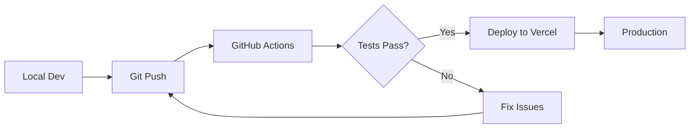

# 🚀 Cursor AI IDE: Building Production Applications

[](https://www.oreilly.com/)
[](https://cursor.com/)
[](https://nextjs.org/)
[](https://react.dev/)

> **Master AI-assisted development** — Learn to build full-stack production applications using Cursor's advanced features, project rules, agents, and MCP integration.

---

## 📋 Course Overview

This hands-on course takes developers beyond basic AI code completion to building complete, production-ready applications. You'll learn advanced Cursor workflows, context management strategies, and deployment best practices through practical, real-world projects.

### What You'll Build

| Project | Description | Tech Stack |
|---------|-------------|------------|
| **Task Manager** | Full CRUD app with auth & real-time features | Next.js, Clerk, Supabase, Tailwind |
| **AI Quiz App** | Intelligent quiz generation from study materials | Next.js, Claude API, Supabase, Clerk |
| **ChronoFocus** | Time-blocking task scheduler | Next.js, Prisma, PostgreSQL |

---

## 🎯 Course Sections

### Section 1: Cursor & Context Management (60 min)
- Codebase indexing and `@` symbol mastery
- Context windows and token management
- Understanding and creating project rules (`.cursor/rules/*.mdc`)
- Agent types and background agents
- Model Context Protocol (MCP) introduction

### Section 2: Building Your First Full App (60 min)
- AI-driven project initialization
- Creating architecture-specific project rules
- Building data layers with storage modules
- Creating UI components with AI assistance
- Adding real-time features

### Section 3: Advanced App Development & Architecture (60 min)
- React project scaffolding with Cursor
- Advanced project rules for React patterns
- State management with Zustand
- Building an AI-powered Quiz App
- MCP for UI testing and prototyping

### Section 4: Real-World Full-Stack Application (45 min)
- Full-stack architecture planning
- Backend development with Server Actions
- Frontend implementation with Server Components
- Real-time collaboration features

### Section 5: Deployment, Testing & Production (45 min)
- Deployment to Vercel
- AI-assisted CI/CD pipelines
- Testing strategies with AI
- Production monitoring and best practices

---

## 📁 Repository Structure

```
cursor-course/
├── 📂 assets-resources/          # Course materials & guides
│   ├── course_outline.md         # Detailed section breakdown
│   ├── cursor-course-complete-proposal.md
│   ├── demo-project-examples.md  # Project templates & prompts
│   ├── presentation_guide.md
│   └── prompting_tips.md
│
├── 📂 presentation/              # Slide deck & scripts
│   ├── cursor-for-modern-dev.pdf
│   ├── presentation.html         # Remark.js slides
│   └── scripts.md
│
├── 📂 chronofocus/               # Demo: Time-blocking app
│   └── prisma/
│       └── schema.prisma
│
├── 📄 PLAN_quiz_app.md           # AI Quiz App PRD
├── 📄 PLAN_task_manager.md       # Task Manager PRD
├── 📄 SETUP_task_manager.md      # Step-by-step setup guide
├── 📄 AGENTS.md                  # Cursor rules & conventions
└── 📄 CLAUDE.md                  # AI assistant context
```

---

## 🛠️ Tech Stack

### Core Technologies
- **Framework:** Next.js 15+ (App Router)
- **Language:** TypeScript / JavaScript
- **Styling:** Tailwind CSS + shadcn/ui + Radix UI
- **State:** Zustand / React Context

### Backend & Data
- **Database:** Supabase (PostgreSQL) / Prisma ORM
- **Authentication:** Clerk
- **AI Integration:** Anthropic Claude API

### Development & Deployment
- **IDE:** Cursor AI
- **Deployment:** Vercel
- **Version Control:** Git + GitHub

---

## 🚦 Prerequisites

Before attending the course, ensure you have:

- [ ] **Cursor IDE** installed ([cursor.com](https://cursor.com))
- [ ] **Node.js 18+** installed
- [ ] **Git** configured
- [ ] Basic familiarity with React and Next.js
- [ ] A **Clerk** account (free tier works)
- [ ] A **Supabase** account (free tier works)
- [ ] A **Vercel** account for deployment

### Optional (for advanced sections)
- [ ] **Anthropic API key** for AI quiz generation
- [ ] **GitHub account** for CI/CD demos

---

## 🏃‍♂️ Quick Start

### 1. Clone the Repository
```bash
git clone https://github.com/EnkrateiaLucca/cursor-course.git
cd cursor-course
```

### 2. Open in Cursor
```bash
cursor .
```

### 3. Review Project Rules
The repository includes pre-configured Cursor rules in `AGENTS.md`:
- Code style (Standard.js, 2-space indent, no semicolons)
- React patterns (functional components, hooks)
- State management (Zustand)
- UI conventions (Tailwind + shadcn/ui)

### 4. Follow Along with Demo Projects
Start with `PLAN_task_manager.md` for a complete walkthrough of building a production app.

---

## 📚 Course Resources

### Product Requirement Documents
| Document | Description |
|----------|-------------|
| [`PLAN_task_manager.md`](./PLAN_task_manager.md) | Complete PRD for Task Manager app |
| [`PLAN_quiz_app.md`](./PLAN_quiz_app.md) | Complete PRD for AI Quiz App |
| [`SETUP_task_manager.md`](./SETUP_task_manager.md) | Step-by-step implementation guide |

### Cursor Configuration
| File | Purpose |
|------|---------|
| [`AGENTS.md`](./AGENTS.md) | Project rules for consistent AI behavior |
| [`CLAUDE.md`](./CLAUDE.md) | Context for AI assistants |

### Reference Materials
| Resource | Content |
|----------|---------|
| [`assets-resources/demo-project-examples.md`](./assets-resources/demo-project-examples.md) | Example prompts & patterns |
| [`assets-resources/prompting_tips.md`](./assets-resources/prompting_tips.md) | Prompting best practices |
| [`assets-resources/cursor_best_practices.md`](./assets-resources/raw-course-materials/cursor_best_practices.md) | Cursor workflow tips |

---

## 🎨 Project Rules Example

The course teaches you to create effective project rules. Here's a sample:

```markdown
# .cursor/rules/api-standards.mdc
---
description: REST API design standards
glob: ["**/api/**/*.ts", "**/routes/**/*.ts"]
---

Always use:
- RESTful naming conventions
- Proper HTTP status codes (200, 201, 400, 401, 404, 500)
- Input validation with Zod
- Error handling middleware
- Consistent response format: { data, error, message }
```

---

## 🔑 Key Concepts Covered

### Context Management
- `@codebase` - Reference entire project
- `@docs` - Include documentation
- `@web` - Search and include web results
- `@filename` - Reference specific files

### Project Rules Types
| Type | When Active | Use Case |
|------|-------------|----------|
| **Always** | Every prompt | Core standards |
| **Auto Attached** | Matching file patterns | File-specific rules |
| **Agent Requested** | AI-initiated | Domain knowledge |
| **Manual** | On-demand | Specialized tasks |

### Agent Modes
- **Planning Mode** - Architecture and design
- **Review Mode** - Code quality checks
- **Tools Mode** - External integrations

---

## 🚀 Deployment Workflow



---

## 📖 Additional Resources

- [Cursor Documentation](https://docs.cursor.com/)
- [Next.js Documentation](https://nextjs.org/docs)
- [Clerk Documentation](https://clerk.com/docs)
- [Supabase Documentation](https://supabase.com/docs)
- [Tailwind CSS](https://tailwindcss.com/docs)
- [shadcn/ui](https://ui.shadcn.com/)

---

## 🤝 Contributing

This is a course repository maintained for O'Reilly live trainings. If you find issues or have suggestions:

1. Open an issue with a clear description
2. For fixes, submit a PR with your changes
3. Follow the existing code style and conventions

---

## 📄 License

This course material is proprietary and intended for O'Reilly live training participants. Please do not redistribute without permission.

---

## 👨‍🏫 Instructor

**Lucas Soares**  
GitHub: [@EnkrateiaLucca](https://github.com/EnkrateiaLucca)

---

<div align="center">

**Ready to build production apps with AI? Let's go! 🚀**

</div>
